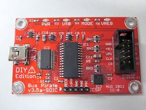
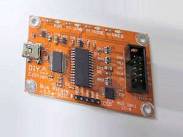
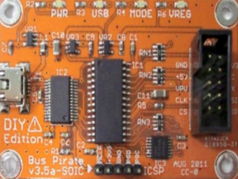
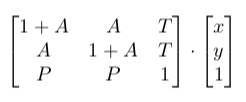

#### Objective
Start with an image of a colorful rectangular object, such as this red PCB.

First, let's transform it. We'll do both affine and projective transforms, and a hue shift too. Why? This is a reasonable way to create augmented training data for a machine learning model. Or it could be simulating the imperfect alignment between a camera and subject in real life.

Then, we'll find the corner points of the rectangle, and rectify the image to a directly overhead viewpoint. Different transformations of the original image should be aligned--even without any knowledge of the true original!

#### Plan

Python and OpenCV make this straightforward. The first program, which generates the various transformed images, is ``generate_variations.py.``

To transform the perspective, we need homogenous coordinates. Affine transforms are a subset of projective transforms, so they get included for free! The basic 2D projective transformation matrix can be thought of like this:

Where the affine transform values are *A*, translation is *T*, and projective transform values are *P*. The program will randomly jitter each *A* and *P* value a small amount. Large projective transforms can be rather extreme--it could project the entire image to a line segment, for example--which wouldn't be useful for the next step. The hue shift is easy, the image just has to be converted to HSV channels.

Aligning the images requires detecting and ordering the corners. ``rectify_variations.py`` will use polygon fitting on a saturation mask to find the corners. Then OpenCV's ``getPerspectiveTransform`` and ``warpPerspective`` generate the rectified view. It's a straightforward use of plane homography.

#### Instructions

First run ``generate_variations``, which will default to creating 25 variations of ``pcb.jpg`` in ``variations.`` Then run ``rectify_variations`` to see them rectified to a true overhead view. Press ``f`` to see the next image, or press ``esc`` to quit the program.

#### Known limitations

* There's no input UI in either program, edit the Python to change the settings.
* The object is detected with a saturation mask. It must be much more colorful than the background. It'd be easy to change this to a brightness/value mask.
* A 'perfect storm' of random paramaters could result in transforms that exceed the padding. If this happens, the corner detection will of course fail.
* The corner sorting isn't truly robust right now. It's possible (though unlikely with defaults) to create a projective transform that will cause it to double up on one corner point.
* The color changes are limited to hue to avoid interfering with the detection.
